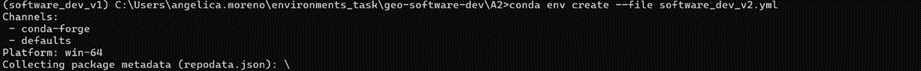

# Environment Setup Task

This guide explains the steps I followed to set up the environments for the Practice of Software Development course from the CDE master.

## 1. Forking the Repository

I forked the original repository in:

🔗 [https://github.com/Angelicarjs/geo-software-dev/tree/main](https://github.com/Angelicarjs/geo-software-dev/tree/main)

## 2. Local Folder Creation

On my local machine, I created a folder to store the project: C:\Users\angelica.moreno\environments_task


## 3. Cloning the Repository

Inside the `environments_task` folder, I cloned the forked repository:


## 4. Verifying Conda Installation
Using the Anaconda Prompt, I navigated to the cloned repository and entered the folder A2, I then checked if conda was installed and verified the version using the command conda --version:


## 5. Creating the First Environment

I created the first environment using the provided `.yml` file, in the next image it's possible to see the process:

```bash
conda env create --file software_dev_v1.yml
```


Also, when it finished


 
## 6.	Activating the First Environment 

Once the installation finished, I activated the environment:


 
## 7. Creating and Activating the Second Environment

I repeated the same process for the second environment. Heare are the images when it started:

 
After it finished:


 
Then I activated the environment:

 
## 8. Verifying All Conda Environments

Finally, with the command >conda info –envs, it’s possible to see the current environments:


 


 


